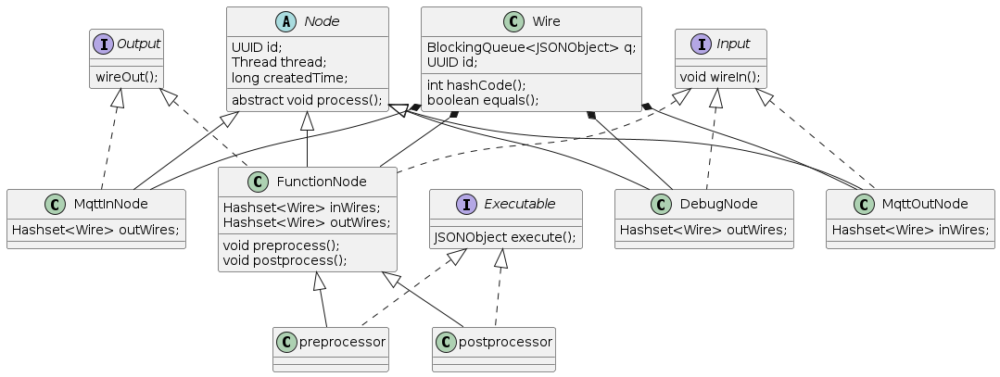

3팀 MQTT PROJECT

조원 : 유승진, 이지현, 임찬휘, 조강일, 홍충표

프로그램 작동 과정
MqttInNode에서 특정 사이트에 들어오는 정보를 받아 json파일로 가공한 후 Wire 클래스를 통해 PreprocessNode로 넘겨주고  
PreprocessNode에서는 Topic을 기준으로 기준에 부합하는 json 내용들을 Wire 클래스를 통해 Postprocess로 넘겨주고  
PostprocessNode에서는 Preprocess에서 받은 json데이터를 오버라이딩하여 원하는 내용의 topic, payload을 가지는 json을 만들어  
Wire 클래스를 통해 MqttOutNode에 넘겨주고 MqttOutNode를 통해 원하는 사이트나 DB등에 자료를 보냅니다.

클래스 구성  
  

설정 파일 구성  
추가한 dependency  
org.json,  
org.projectlombok,  
ch.qos.logback,  
org.junit.jupiter,  
org.eclipse.paho,  
commons-cli  

에러 경험  

MqttInNode

    try (IMqttClient client = new MqttClient(URI, id)) {
        client.connect();

        오류가 발생했던 코드  
        // for (Wire wire : outWires) {
        //     client.subscribe("#", (topic, msg) -> {
        //         JSONObject object = new JSONObject();
        //         object.put("topic", topic);
        //         object.put("payload", msg);
        //         wire.getBq().add(object);
        //         log.info(wire.getBq().size()+wire.toString());
        //     });
        // }
        
        람다식에서 키 값이 같기 때문에 새로운 객체가 생성되지 않고 기존에 있던 객체에 덮어씌어지는 문제가  
        발생하였음

        오류를 해결한 코드  
        client.subscribe("#", (topic, msg) -> {
            for (Wire wire : outWires) {
                JSONObject object = new JSONObject();
                object.put("topic", topic);
                object.put("payload", msg);
                wire.getBq().add(object);
                log.info(wire.getBq().size()+wire.toString());
            }

        subcribe를 단일이 아닌 여러개를 받을 수 있게 바꾸어 위 코드의 문제점이던 기존 객체에 덮어씌어지는 문제를
        해결하였음  
    });

--an 옵션과 -s 옵션 외에  
-p 옵션을 추가하며 --additional 을 추가한다.
하는 역할은 기본으로 가져오는 옵션 외에 가져오고 싶은 옵션을 추가하는 옵션이다.

피드백 전 코드와 피드백 이후 코드를 리드미에 적어봅시다.  
